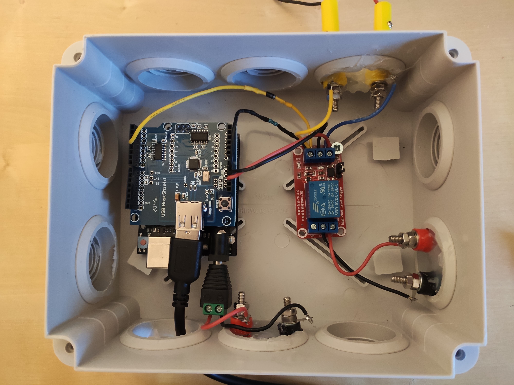
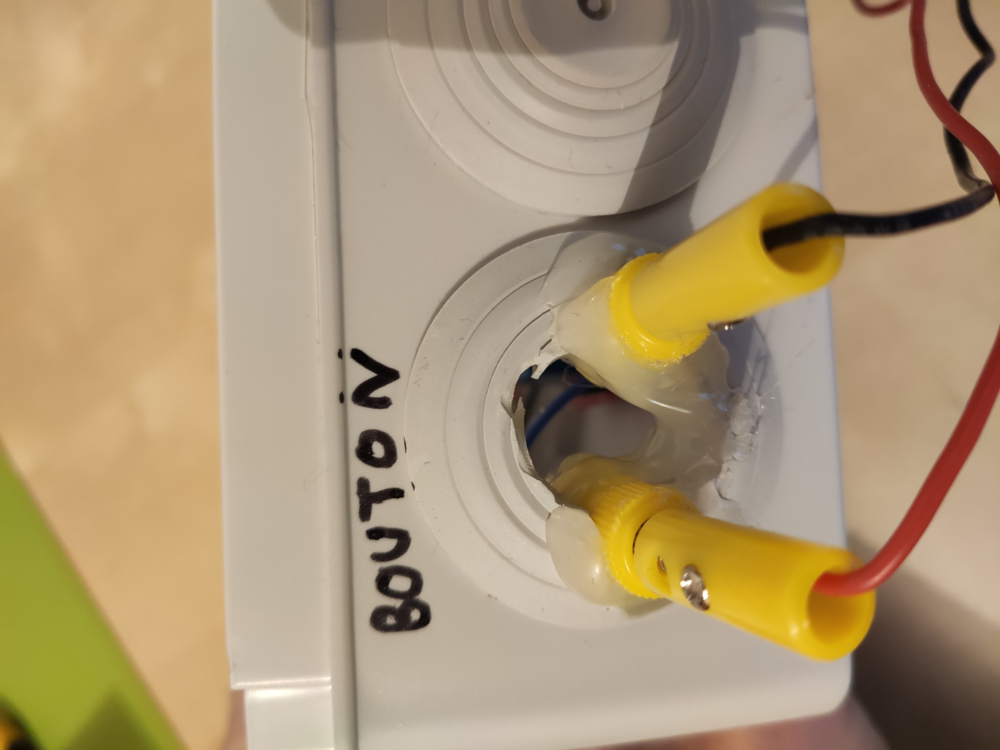

# USB-barcode-scanner

Read barcode with a USB barcode scanner, an Arduino and a [USB host shield v2.0](https://github.com/felis/USB_Host_Shield_2.0).

Initial arduino code found [here](https://github.com/DirgaBrajamusti/Arduino-USB-Barcode-Scanner/blob/master/Barcode%20Scan%20only.ino). 

## Hardware

Here are the hardware case images:

